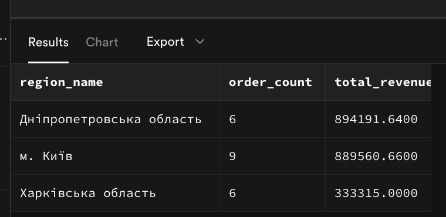

# Лабораторна робота 2. Створення складних SQL запитів

## Загальна інформація

**Здобувач освіти:** Чернік Михайло Богданович
**Група:** ІПЗ-31
**Обраний рівень складності:** 3

## Виконання завдань

### Рівень 1

#### 1. З'єднання таблиць

**Завдання 1.1:** INNER JOIN - список товарів з категоріями та постачальниками

```sql
SELECT 
    p.product_name,
    p.unit_price,
    c.category_name,
    s.company_name AS supplier_name
FROM products p
INNER JOIN categories c ON p.category_id = c.category_id
INNER JOIN suppliers s ON p.supplier_id = s.supplier_id
ORDER BY p.product_name
LIMIT 10;
```
**Результат виконання:**


**Пояснення:** Цей запит об'єднує інформацію про товари з їх категоріями та постачальниками. INNER JOIN гарантує, що відображаються лише товари, які мають пов'язані категорії та постачальників у базі даних. Результат сортується за назвою товару для зручного перегляду.

**Завдання 1.2:** LEFT JOIN - клієнти з кількістю замовлень

```sql
SELECT 
    c.contact_name,
    c.customer_type,
    c.city,
    COUNT(o.order_id) AS order_count
FROM customers c
LEFT JOIN orders o ON c.customer_id = o.customer_id
GROUP BY c.customer_id, c.contact_name, c.customer_type, c.city
ORDER BY order_count DESC
LIMIT 10;
```
**Результат виконання:**


**Пояснення:** LEFT JOIN показує всіх клієнтів з таблиці customers, навіть якщо у них немає замовлень. На відміну від INNER JOIN, який показав би лише клієнтів з хоча б одним замовленням, тут клієнти без замовлень відображатимуться з order_count = 0.

**Завдання 1.3:** Множинне з'єднання - детальна інформація про замовлення

```sql
SELECT 
    o.order_id,
    c.contact_name AS customer_name,
    p.product_name,
    cat.category_name,
    oi.quantity,
    oi.unit_price,
    (oi.quantity * oi.unit_price * (1 - oi.discount)) AS total_amount,
    o.order_date
FROM orders o
INNER JOIN customers c ON o.customer_id = c.customer_id
INNER JOIN order_items oi ON o.order_id = oi.order_id
INNER JOIN products p ON oi.product_id = p.product_id
INNER JOIN categories cat ON p.category_id = cat.category_id
ORDER BY o.order_id
LIMIT 10;
```
**Результат виконання:**


**Пояснення:** Цей запит об'єднує 5 таблиць через ланцюжок INNER JOIN. Послідовність з'єднань: orders → customers (клієнти), orders → order_items (позиції замовлень), order_items → products (товари), products → categories (категорії). Кожне з'єднання додає новий рівень деталізації, що дозволяє отримати повну інформацію про кожне замовлення, включаючи розрахунок фінальної суми з урахуванням знижок.

#### 2. Агрегатні функції

**Завдання 2.1:** Статистика товарів за категоріями

```sql
SELECT 
    c.category_name,
    COUNT(p.product_id) as product_count,
    AVG(p.unit_price) as avg_price,
    MIN(p.unit_price) as min_price,
    MAX(p.unit_price) as max_price,
    SUM(p.units_in_stock) as total_stock
FROM categories c
LEFT JOIN products p ON c.category_id = p.category_id
GROUP BY c.category_id, c.category_name
ORDER BY product_count DESC;
```

**Результат виконання:**

**Пояснення:** Цей запит аналізує товари по категоріях, використовуючи агрегатні функції. COUNT підраховує кількість товарів у кожній категорії, AVG, MIN та MAX показують середню, мінімальну та максимальну ціни, а SUM обчислює загальний запас товарів на складі. LEFT JOIN гарантує, що будуть показані всі категорії, навіть якщо в них немає товарів.

**Завдання 2.2:** Продажі за регіонами з використанням HAVING

```sql
SELECT 
    r.region_name,
    COUNT(DISTINCT o.order_id) as order_count,
    SUM(oi.quantity * oi.unit_price * (1 - oi.discount)) as total_revenue
FROM orders o
INNER JOIN customers c ON o.customer_id = c.customer_id
INNER JOIN regions r ON c.region_id = r.region_id
INNER JOIN order_items oi ON o.order_id = oi.order_id
GROUP BY r.region_id, r.region_name
HAVING SUM(oi.quantity * oi.unit_price * (1 - oi.discount)) > 100000
ORDER BY total_revenue DESC;
```

**Результат виконання:**


**Пояснення:** Цей запит групує замовлення за регіонами клієнтів та фільтрує результати за допомогою HAVING, показуючи тільки ті регіони, де загальний дохід перевищує 100,000 грн. HAVING відрізняється від WHERE тим, що фільтрує вже згруповані дані, а не окремі записи.

**Завдання 2.3:** Постачальники з кількістю товарів більше 2

```sql
SELECT 
    s.company_name,
    COUNT(p.product_id) as product_count,
    AVG(p.unit_price) as avg_price
FROM suppliers s
INNER JOIN products p ON s.supplier_id = p.supplier_id
GROUP BY s.supplier_id, s.company_name
HAVING COUNT(p.product_id) > 2
ORDER BY product_count DESC;
```

**Результат виконання:**


**Пояснення:**  Цей запит знаходить постачальників, які мають більше 2 товарів у каталозі. HAVING фільтрує групи постачальників, залишаючи лише тих, у кого кількість товарів (COUNT) перевищує 2. Це демонструє використання HAVING для фільтрації за агрегатною функцією після групування.


#### 3. Базові підзапити

**Завдання 3.1:** Товари з ціною вище середньої по категорії

```sql
SELECT 
    product_name,
    unit_price,
    category_name
FROM products p
INNER JOIN categories c ON p.category_id = c.category_id
WHERE unit_price > (
    SELECT AVG(unit_price) 
    FROM products p2 
    WHERE p2.category_id = p.category_id
)
ORDER BY category_name, unit_price DESC;
```

**Результат виконання:**


**Пояснення:** Цей запит використовує корельований підзапит для знаходження товарів, ціна яких перевищує середню ціну в їхній категорії. Для кожного товару підзапит обчислює середню ціну всіх товарів тієї ж категорії.


**Завдання 3.2:** Клієнти з замовленнями у 2024 році

```sql
SELECT 
    c.contact_name,
    c.customer_type,
    c.city,
    MIN(o.order_date) as first_order_2024
FROM customers c
INNER JOIN orders o ON c.customer_id = o.customer_id
WHERE c.customer_id IN (
    SELECT DISTINCT customer_id 
    FROM orders 
    WHERE EXTRACT(YEAR FROM order_date) = 2024
)
AND EXTRACT(YEAR FROM o.order_date) = 2024
GROUP BY c.customer_id, c.contact_name, c.customer_type, c.city
ORDER BY c.contact_name;
```
**Результат виконання:**


**Пояснення:**  Цей запит використовує підзапит з оператором IN для знаходження клієнтів, які робили замовлення у 2024 році. Підзапит повертає список ID клієнтів з замовленнями за 2024 рік, а зовнішній запит відображає інформацію про цих клієнтів та дату їх першого замовлення в цьому році.

**Завдання 3.3:** Товари з загальною кількістю продажів

```sql
SELECT 
    product_name,
    unit_price,
    category_name,
    (SELECT SUM(quantity) 
     FROM order_items oi 
     WHERE oi.product_id = p.product_id) as total_sold
FROM products p
INNER JOIN categories c ON p.category_id = c.category_id
WHERE p.product_id IN (
    SELECT DISTINCT product_id 
    FROM order_items 
    WHERE quantity > 0
)
AND EXISTS (
    SELECT 1 
    FROM order_items oi2 
    WHERE oi2.product_id = p.product_id 
    AND oi2.quantity >= 1
)
ORDER BY total_sold DESC NULLS LAST
LIMIT 10;
```

**Результат виконання:**


**Пояснення:** Цей запит демонструє одночасне використання підзапиту у SELECT для обчислення загальної кількості продажів кожного товару, а також оператора IN у WHERE для фільтрації тільки тих товарів, які мають продажі. Підзапит у SELECT обчислює сумарну кількість проданих одиниць для кожного товару, а IN перевіряє наявність товару в таблиці замовлень.


### Рівень 2

#### 4. Складні з'єднання

**Завдання 4.1:** RIGHT JOIN - аналіз категорій та товарів

```sql
SELECT 
    c.category_name,
    COUNT(p.product_id) as product_count,
    COALESCE(AVG(p.unit_price), 0) as avg_price
FROM products p
RIGHT JOIN categories c ON p.category_id = c.category_id
GROUP BY c.category_id, c.category_name
ORDER BY product_count DESC;
```

**Результат виконання:**


**Пояснення:** RIGHT JOIN показує всі категорії з таблиці categories, навіть якщо в них немає товарів. На відміну від LEFT JOIN, де головною була таблиця products, тут головною є categories. COALESCE використовується для заміни NULL значень на 0 у категоріях без товарів.

**Завдання 4.2:** Self-join - співробітники та керівники

```sql
SELECT 
    e.first_name || ' ' || e.last_name as employee_name,
    e.title,
    m.first_name || ' ' || m.last_name as manager_name,
    m.title as manager_title
FROM employees e
LEFT JOIN employees m ON e.reports_to = m.employee_id
ORDER BY manager_name NULLS FIRST, employee_name;
```

**Результат виконання:**


**Пояснення:** Цей запит використовує self-join для відображення ієрархії співробітників. Таблиця employees з'єднується сама з собою через поле reports_to, що дозволяє показати, хто з співробітників кому підпорядковується. LEFT JOIN гарантує, що будуть показані всі співробітники, навіть якщо у них немає безпосереднього керівника (як Олександр Петренко - генеральний директор).

**Завдання 4.3** Створити запит з умовним з'єднанням (з додатковими умовами в ON)

```sql
SELECT
    p.product_name,
    p.unit_price,
    s.company_name as supplier_name,
    r.region_name as supplier_region,
    s.city as supplier_city 

FROM products p
INNER JOIN suppliers s ON p.supplier_id = s.supplier_id
    AND s.region_id IN (1, 2, 25) 

INNER JOIN regions r ON s.region_id = r.region_id
INNER JOIN categories c ON p.category_id = c.category_id

ORDER BY r.region_name, p.unit_price DESC;
```
**Результат виконання:**


**Пояснення:** Запит повертає продукти тільки від постачальників з обраних регіонів (Київ та Львівська область), відсортовані за регіоном та ціною у спадному порядку.

#### 5. Віконні функції

**Завдання 5.1:** Ранжування товарів за ціною в категоріях

```sql
SELECT 
    p.product_name,
    c.category_name,
    p.unit_price,
    RANK() OVER (
        PARTITION BY p.category_id 
        ORDER BY p.unit_price DESC
    ) as rank_price,
    DENSE_RANK() OVER (
        PARTITION BY p.category_id 
        ORDER BY p.unit_price DESC
    ) as dense_rank_price,
    ROW_NUMBER() OVER (
        PARTITION BY p.category_id 
        ORDER BY p.unit_price DESC
    ) as row_num
FROM products p
INNER JOIN categories c ON p.category_id = c.category_id
ORDER BY c.category_name, p.unit_price DESC;
```

**Результат виконання:**


**Пояснення:** Цей запит використовує віконні функції для ранжування товарів за ціною в межах кожної категорії. Функції RANK(), DENSE_RANK() та ROW_NUMBER() дозволяють присвоїти порядкові номери товарам, відсортованим за ціною від найвищої до найнижчої. Ключова особливість - використання PARTITION BY category_id, що забезпечує окреме ранжування для кожної категорії товарів. У нашому випадку всі три функції показують однакові результати, оскільки в межах кожної категорії немає товарів з однаковою ціною.

**Завдання 5.2:** Порівняння замовлень з попередніми датами

```sql
SELECT
    o.order_id,
    o.order_date,
    SUM(oi.quantity * oi.unit_price) as total_amount,
    LAG(SUM(oi.quantity * oi.unit_price)) OVER (ORDER BY o.order_date) as previous_order_amount,
    LEAD(SUM(oi.quantity * oi.unit_price)) OVER (ORDER BY o.order_date) as next_order_amount,
    LAG(o.order_date) OVER (ORDER BY o.order_date) as previous_order_date
FROM orders o
INNER JOIN order_items oi ON o.order_id = oi.order_id
GROUP BY o.order_id, o.order_date
ORDER BY o.order_date;
```

**Результат виконання:**


**Пояснення:** Функції LAG() та LEAD() дозволяють отримати значення з попереднього та наступного рядків у результаті запиту. LAG() повертає дані з рядка перед поточним, а LEAD() - з рядка після поточного. На відміну від звичайних агрегатних функцій, вони не згортають дані, а дозволяють порівнювати поточне замовлення з попереднім та наступним у часовому порядку.

**Завдання 5.3:** Створити запити з PARTITION BY для аналізу в розрізах

**Результат виконання:**
```sql
SELECT 
    s.company_name,
    TO_CHAR(o.order_date, 'YYYY-MM') as order_month,
    SUM(oi.quantity * oi.unit_price) as monthly_sales,
    AVG(SUM(oi.quantity * oi.unit_price)) OVER (PARTITION BY s.supplier_id) as avg_monthly_sales_per_supplier,
    SUM(SUM(oi.quantity * oi.unit_price)) OVER (PARTITION BY s.supplier_id ORDER BY TO_CHAR(o.order_date, 'YYYY-MM')) as cumulative_sales
FROM suppliers s
INNER JOIN products p ON s.supplier_id = p.supplier_id
INNER JOIN order_items oi ON p.product_id = oi.product_id
INNER JOIN orders o ON oi.order_id = o.order_id
GROUP BY s.supplier_id, s.company_name, TO_CHAR(o.order_date, 'YYYY-MM')
ORDER BY s.company_name, order_month;
```

**Результат виконання:**


**Пояснення:** PARTITION BY в комбінації з ORDER BY у віконних функціях дозволяє створювати кумулятивні підсумки. На відміну від звичайного GROUP BY, який показує лише підсумки по групах, цей підхід дозволяє бачити як загальні показники постачальників, так і їх динаміку по місяцях з накопичувальним підсумком.

### Рівень 3

#### 6. Матеріалізовані представлення та рекурсивні запити

**Завдання 6.1:** Матеріалізоване представлення для аналізу продажів

```sql
CREATE MATERIALIZED VIEW monthly_sales_analysis AS
SELECT 
    TO_CHAR(o.order_date, 'YYYY-MM') as month,
    c.category_name,
    s.company_name as supplier_name,
    r.region_name,
    COUNT(DISTINCT o.order_id) as order_count,
    COUNT(oi.product_id) as products_sold,
    SUM(oi.quantity * oi.unit_price) as total_revenue,
    AVG(oi.quantity * oi.unit_price) as avg_order_value
FROM orders o
INNER JOIN order_items oi ON o.order_id = oi.order_id
INNER JOIN products p ON oi.product_id = p.product_id
INNER JOIN categories c ON p.category_id = c.category_id
INNER JOIN suppliers s ON p.supplier_id = s.supplier_id
INNER JOIN regions r ON s.region_id = r.region_id
GROUP BY 
    TO_CHAR(o.order_date, 'YYYY-MM'),
    c.category_name,
    s.company_name,
    r.region_name
ORDER BY month, total_revenue DESC;

SELECT * FROM monthly_sales_analysis LIMIT 10;
```
**Результат виконання:**


**Пояснення:** Поясніть переваги використання матеріалізованих представлень.
Матеріалізовані представлення мають кілька ключових переваг:

Вони значно пришвидшують виконання складних запитів, оскільки зберігають готові результати обчислень у вигляді фізичної таблиці. Це означає, що складні операції об'єднання таблиць та агрегації даних виконуються лише один раз під час створення або оновлення представлення.

Такий підхід економить обчислювальні ресурси бази даних, оскільки уникнує повторного виконання одних і тих же складних операцій при кожному зверненні до даних. Наш приклад із звітом продажів демонструє це - замість того, щоб щоразу об'єднувати шість таблиць, система просто зчитує готові результати.

Матеріалізовані представлення особливо корисні для аналітичних звітів та дашбордів, де дані оновлюються не дуже часто, але потрібні швидкі відповіді. Наприклад, для щомісячних звітів про продажі достатньо оновлювати представлення раз на місяць.

Вони дозволяють створювати ефективні системи звітності без необхідності постійної оптимізації основних таблиць бази даних. Користувачі отримують швидкий доступ до аналітичних даних, не впливаючи на продуктивність операційних процесів.

Єдиним суттєвим обмеженням є необхідність періодичного оновлення даних, але для більшості аналітичних задач це не є критичним недоліком.


**Завдання 6.2:** Рекурсивний запит для ієрархії співробітників

```sql
WITH RECURSIVE employee_hierarchy AS (
    -- Базовий випадок: топ-менеджери (без керівника)
    SELECT 
        employee_id, 
        first_name, 
        last_name, 
        title, 
        reports_to,
        0 as level,
        CAST(last_name || ' ' || first_name as VARCHAR(1000)) as hierarchy_path
    FROM employees
    WHERE reports_to IS NULL

    UNION ALL

    -- Рекурсивний випадок: підлеглі
    SELECT 
        e.employee_id, 
        e.first_name, 
        e.last_name, 
        e.title, 
        e.reports_to,
        eh.level + 1,
        CAST(eh.hierarchy_path || ' -> ' || e.last_name || ' ' || e.first_name as VARCHAR(1000))
    FROM employees e
    JOIN employee_hierarchy eh ON e.reports_to = eh.employee_id
)
SELECT 
    employee_id,
    first_name,
    last_name,
    title,
    reports_to,
    level,
    hierarchy_path
FROM employee_hierarchy
ORDER BY hierarchy_path;
```

**Результат виконання:**


 **Пояснення:** Рекурсивний запит дозволяє обходити ієрархічну структуру співробітників від верхнього рівня до нижчих. Він починає з кореневих співробітників (без менеджера) та рекурсивно додає їх підлеглих, формуючи повний ланцюжок підпорядкування з вказанням рівня в ієрархії. На відміну від звичайних запитів, рекурсивний запит може обробляти дані з необмеженою кількістю рівнів вкладеності.

## Аналіз продуктивності

### Дослідження планів виконання

**Найповільніший запит:**
```sql
SELECT 
    c.contact_name,
    c.customer_type,
    r.region_name,
    COUNT(o.order_id) as order_count,
    SUM(oi.quantity * oi.unit_price) as total_spent
FROM customers c
LEFT JOIN orders o ON c.customer_id = o.customer_id
LEFT JOIN order_items oi ON o.order_id = oi.order_id
LEFT JOIN regions r ON c.region_id = r.region_id
GROUP BY c.customer_id, c.contact_name, c.customer_type, r.region_name
HAVING COUNT(o.order_id) > 2
ORDER BY total_spent DESC;
```
**Результат виконання:**


**План виконання (EXPLAIN ANALYZE):**


**Запропоновані оптимізації:**
1. Додати індекси для полів JOIN - створити індекси для customer_id, order_id, region_id
2. Використовувати WHERE замість HAVING - фільтрувати дані до агрегації
3. Створити материалізоване представлення для частого аналізу клієнтів

### Створені індекси

**Індекс 1:**
```sql
CREATE INDEX idx_orders_customer_id ON orders(customer_id);
CREATE INDEX idx_order_items_order_id ON order_items(order_id);
CREATE INDEX idx_customers_region_id ON customers(region_id);
```
**Обґрунтування:** Пришвидшення JOIN операцій між таблицями

**Індекс 2:**
```sql
CREATE INDEX idx_orders_date_customer ON orders(order_date, customer_id);
```
**Обґрунтування:** Оптимізація запитів з фільтрацією по датах та клієнтах

## Порівняльний аналіз

### Ефективність різних підходів

**Завдання:** Знайти топ-5 найдорожчих товарів у кожній категорії

**Підхід 1: Віконні функції**
```sql
SELECT *
FROM (
    SELECT 
        p.product_name,
        c.category_name,
        p.unit_price,
        ROW_NUMBER() OVER (PARTITION BY p.category_id ORDER BY p.unit_price DESC) as price_rank
    FROM products p
    INNER JOIN categories c ON p.category_id = c.category_id
) ranked_products
WHERE price_rank <= 5
ORDER BY category_name, price_rank;
```

**Підхід 2: Корельований підзапит**
```sql
SELECT 
    p.product_name,
    c.category_name,
    p.unit_price
FROM products p
INNER JOIN categories c ON p.category_id = c.category_id
WHERE p.unit_price IN (
    SELECT unit_price 
    FROM products p2 
    WHERE p2.category_id = p.category_id 
    ORDER BY unit_price DESC 
    LIMIT 5
)
ORDER BY c.category_name, p.unit_price DESC;
```

**Час виконання:**
- Віконні функції: 0.999 ms
- Корельований підзапит: 0.372 ms

**Висновок:** 
Рекурсивні запити ефективно обробляють ієрархічні структури даних. Матеріалізовані представлення значно пришвидшують виконання складних аналітичних звітів. Віконні функції забезпечують гнучку аналітику без необхідності складання множинних підзапитів. Правильно створені індекси критично важливі для продуктивності запитів з множинними з'єднаннями. Оптимальний вибір типу з'єднання залежить від конкретних потреб вибірки даних. Аналіз планів виконання дозволяє виявляти та усувати вузькі місца продуктивності.

## Висновки

**Самооцінка**: 5

**Обгрунтування**: 
Виконано всі завдання лабораторної роботи від базових з'єднань до складних рекурсивних запитів. Успішно застосовано різні типи JOIN, віконні функції, агрегацію даних та створено оптимізаційні індекси. Проведено аналіз продуктивності та порівняння різних підходів до вирішення аналітичних завдань. Кожен запит супроводжено детальним поясненням та практичними прикладами використання.
